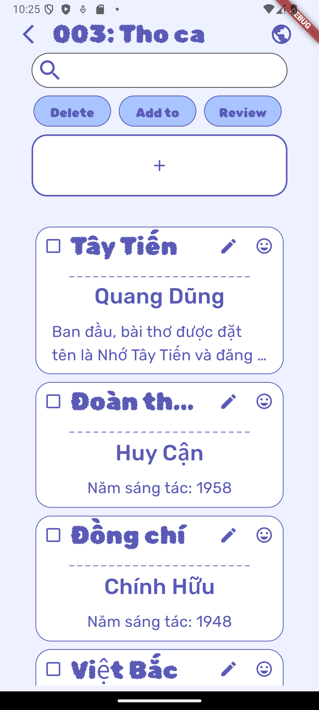
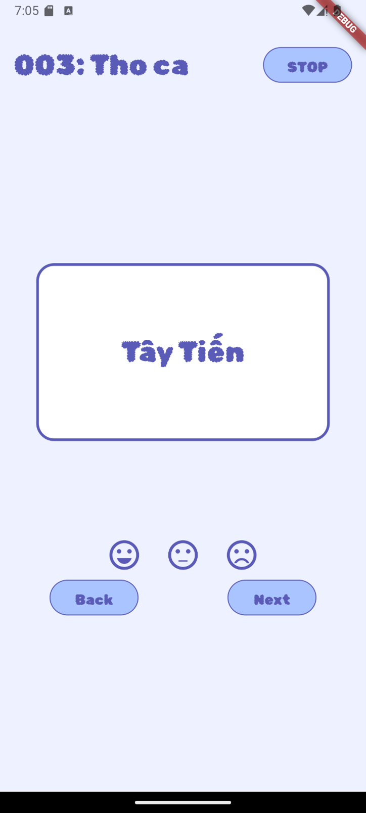
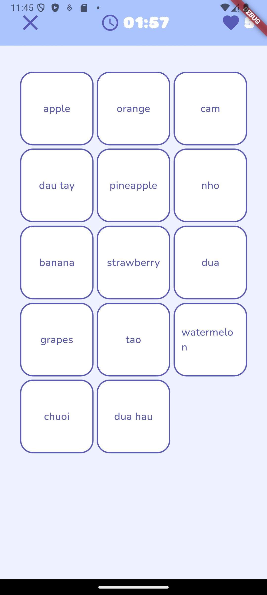
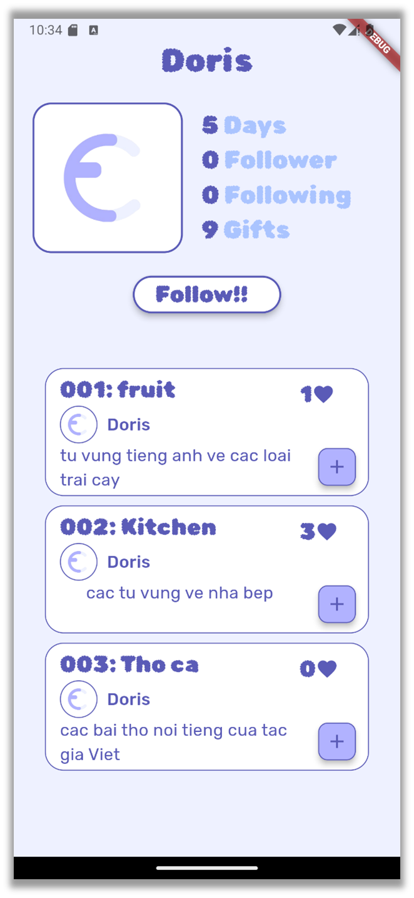

# 📚 Mobile Flashcard  

**Mobile Flashcard** là ứng dụng giúp người dùng tạo và ôn tập thẻ ghi nhớ bằng phương pháp **chủ động gợi nhớ** và **lặp lại ngắt quãng**, giúp tăng khả năng ghi nhớ hiệu quả hơn.  

## 🚀 Công nghệ sử dụng  
- **Flutter** để phát triển ứng dụng di động.  
- **C# Backend** ([Link repo](https://github.com/DTDungg/CSharp_FlashCard.git)).  

## 🎯 Tính năng chính  
✅ **Trang chủ:** Hiển thị bảng thống kê và nhắc nhở ôn tập nhanh.  

✅ **Quản lý thẻ & bộ thẻ:** Thêm, xóa, sửa thẻ và bộ thẻ.  

✅ **Chơi game ôn tập:** Chọn cặp thẻ đồng nghĩa để ghi nhớ tốt hơn.  

✅ **Cộng đồng người dùng:**  
   - Xem **bảng xếp hạng**.  
   - Tham khảo **bộ thẻ công khai** từ người dùng khác.  

✅ **Thông tin người dùng:**  
   - Xem **thông tin cá nhân**.  

## 📥 Liên hệ  
📧 Email: dorisdovn@gmail.com
